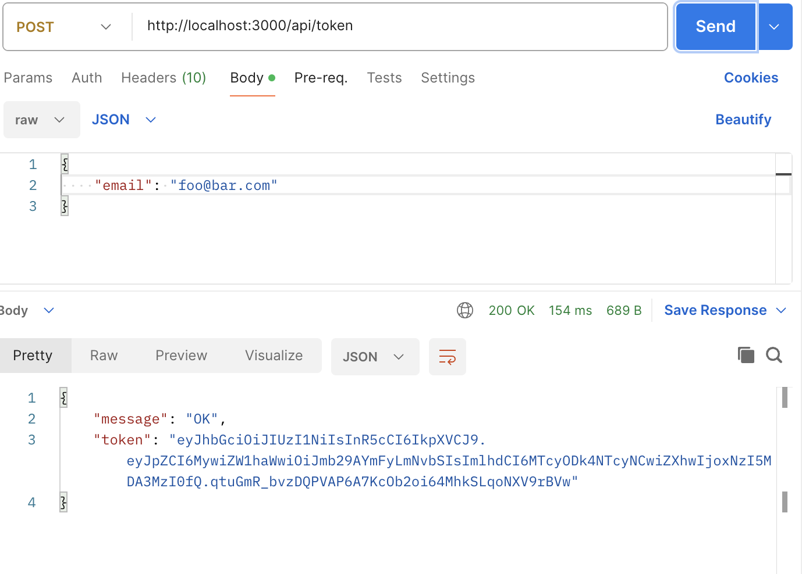

## Local run
To locally run the API, you need to

> npm run build

> npm run start

These two command will build and run the nodejs server.

Finally, run

> docker-compose up

at the root of the directory to run the postgres database

You can also change the environment variables in the docker-compose.yml and in the .env

but keep in mind that normally you WOULD NOT push your .env and expose your environment variables, but keep everything in the .env and add a rule in .gitignore like :

> .env

so your .env is never pushed.

Now that you server is running, you will need to get a token to access the /api/justify route passing your email in a json body:

You can use this token to access the /api/justify route by passing it through "Authorization" in the headers of the request like :
> "Authorization" "Bearer your_token"

The body should be a raw text :

## Using the publi url

Since the api is on a public url, you can use this url

> https://justify-jd798e2qa-justifyme.vercel.app

instead of 

> http://localhost:3000
